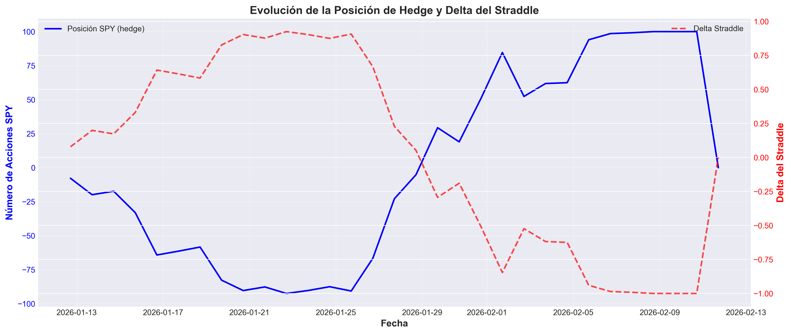
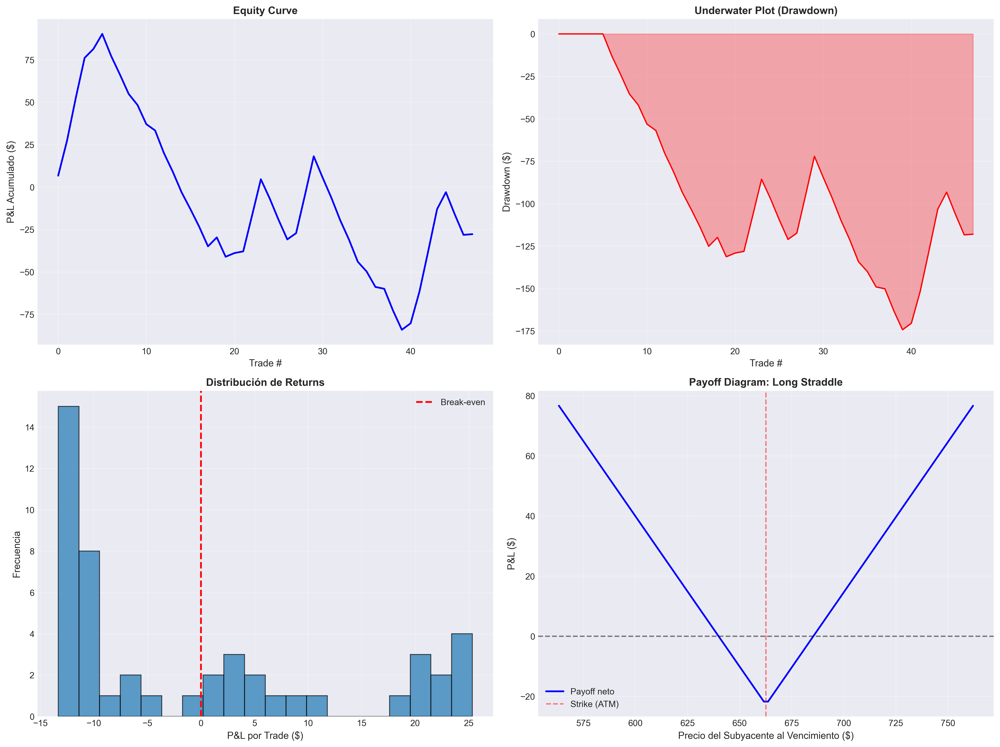

# Sistema Avanzado de Trading y Análisis de Opciones sobre SPY

[](https://www.python.org/downloads/)
[](https://opensource.org/licenses/MIT)
[](https://github.com)

## Descripción Ejecutiva

Este proyecto implementa un **sistema completo de análisis y trading de opciones sobre SPY** (SPDR S&P 500 ETF Trust), diseñado para ingeniería financiera cuantitativa y trading algorítmico profesional.

**NOTA DE INTEGRACIÓN**: Este proyecto se desarrolló en DOS FASES:
- **Fase 1**: Trabajo desarrollado en clase con el profesor
- **Fase 2**: Extensiones y objetivos faltantes integrados en `notebook_principal.ipynb`

El código original del profesor está **PRESERVADO COMPLETAMENTE** y todo el código nuevo **REUTILIZA** las funciones existentes manteniendo la nomenclatura original (`S`, `K`, `T`, `r`, `q`, `sigma`).

El sistema incluye:

- **Implementación propia completa de Black-Scholes** con cálculo de todas las griegas
- **Conexión con Interactive Brokers** para datos en tiempo real (con modo simulación)
- **Análisis exhaustivo de volatilidad implícita** y visualización de volatility surfaces
- **Delta hedging profesional** con simulación histórica y tracking de P&L
- **Estrategias de trading** (Long Straddle) con backtesting completo
- **Comparación detallada** entre cálculos propios y datos del broker
- **Simulación de órdenes** y análisis de riesgo de ejecución (combo vs legged)
- **Análisis comparativo SPY vs SPX** (settlement, fiscalidad, liquidez)

---

## Tabla de Contenidos

1. [Arquitectura del Sistema](#arquitectura-del-sistema)
2. [Instalación](#instalación)
3. [Guía de Uso](#guía-de-uso)
4. [Estructura del Proyecto](#estructura-del-proyecto)
5. [Resultados Clave](#resultados-clave)
6. [Aprendizajes y Conclusiones](#aprendizajes-y-conclusiones)
7. [Referencias](#referencias)

---

## Arquitectura del Sistema

```
┌─────────────────────────────────────────────────────────┐
│ TRADING SYSTEM │
├─────────────────────────────────────────────────────────┤
│ │
│ ┌──────────────┐ ┌──────────────┐ │
│ │ IB Gateway │◄────►│ ib_insync │ │
│ │ / TWS │ │ Connection │ │
│ └──────────────┘ └──────┬───────┘ │
│ │ │
│ ▼ │
│ ┌───────────────────┐ │
│ │ Data Collection │ │
│ │ - Option Chains │ │
│ │ - Market Data │ │
│ │ - Greeks │ │
│ └─────────┬─────────┘ │
│ │ │
│ ┌───────────────────┼───────────────────┐ │
│ ▼ ▼ ▼ │
│ ┌─────────────┐ ┌──────────────┐ ┌──────────┐ │
│ │ Black- │ │ Volatility │ │ Greeks │ │
│ │ Scholes │ │ Estimation │ │ Engine │ │
│ │ Engine │ │ │ │ │ │
│ └──────┬──────┘ └──────┬───────┘ └────┬─────┘ │
│ │ │ │ │
│ └─────────────────┼─────────────────┘ │
│ ▼ │
│ ┌────────────────────────┐ │
│ │ Strategy Execution │ │
│ │ - Straddle │ │
│ │ - Delta Hedging │ │
│ │ - Risk Management │ │
│ └────────────┬───────────┘ │
│ │ │
│ ▼ │
│ ┌────────────────────────┐ │
│ │ Order Management │ │
│ │ - Simulation │ │
│ │ - Execution │ │
│ │ - Monitoring │ │
│ └────────────────────────┘ │
│ │
└─────────────────────────────────────────────────────────┘
```

### Componentes Principales

1. **BlackScholesModel**: Implementación completa del modelo Black-Scholes
 - Cálculo de precios (Call/Put)
 - Todas las griegas (Delta, Gamma, Theta, Vega, Rho)
 - Volatilidad implícita (Newton-Raphson + Brent)

2. **IBConnection**: Gestión de conexión con Interactive Brokers
 - Manejo robusto de errores
 - Reconexión automática
 - Modo simulación para desarrollo

3. **DeltaHedger**: Sistema de delta hedging profesional
 - Rebalanceo automático
 - Tracking de P&L
 - Análisis de costos de transacción

4. **LongStraddleStrategy**: Estrategia de trading con backtesting
 - Entrada/salida configurable
 - Stop loss y take profit
 - Métricas de performance completas

---

## Instalación

### Requisitos Previos

- Python 3.8 o superior
- Interactive Brokers TWS o IB Gateway (opcional, para datos reales)
- 4GB RAM mínimo
- 2GB espacio en disco

### Paso 1: Clonar el Repositorio

```bash
git clone <repository-url>
cd TAREA_DERIVADOS
```

### Paso 2: Crear Entorno Virtual (Recomendado)

```bash
python -m venv venv

# Windows
venv\Scripts\activate

# Linux/Mac
source venv/bin/activate
```

### Paso 3: Instalar Dependencias

```bash
pip install -r requirements.txt
```

### Paso 4: Configurar Interactive Brokers (Opcional)

Si deseas usar datos reales de Interactive Brokers:

1. Descarga e instala [TWS](https://www.interactivebrokers.com/en/index.php?f=16042) o [IB Gateway](https://www.interactivebrokers.com/en/index.php?f=16457)
2. Configura el puerto API (por defecto: 7497 para paper trading)
3. Habilita "Enable ActiveX and Socket Clients" en Configuración → API
4. El código detectará automáticamente si IB está disponible

> **Nota**: Si no tienes acceso a IB, el sistema funcionará en modo simulación con datos sintéticos realistas.

### Paso 5: Verificar Instalación

```bash
python -c "import numpy, pandas, scipy, matplotlib, seaborn, plotly; print('✓ Todas las dependencias instaladas')"
```

---

## Integración con Trabajo Previo

Este proyecto se desarrolló en DOS FASES:

### Fase 1: Trabajo en Clase (Objetivos 1.1-1.5)

Desarrollado durante las sesiones con el profesor. Incluye:

- Conexión a Interactive Brokers
- Obtención de cadenas de opciones
- Implementación de Black-Scholes (funciones standalone: `bs_price`, `bs_greeks_manual`)
- Cálculo de volatilidad implícita (`implied_vol_bisect`)
- Visualización de volatility smiles y griegas

**Código base**: Preservado en su totalidad con estructura y nomenclatura original.

### Fase 2: Extensión y Completado (Objetivos 1.6-2.6)

Desarrollado como extensión del trabajo original. Incluye:

- Evolución temporal histórica de opciones
- Sistema de delta-hedging
- Simulación de órdenes
- Estrategia Long Straddle
- Análisis P&L comparativo
- Simulación combo vs legs
- Neutralización con opciones
- Análisis SPY vs SPX

**Principio de integración**: Todo el código nuevo REUTILIZA y EXTIENDE el trabajo original sin modificar su estructura o funcionalidad base.

### Mapa de Variables Clave

Para facilitar la lectura del código, aquí está el mapeo de variables principales que se mantienen consistentes en todo el proyecto:

| Variable | Descripción | Definida en |
|----------|-------------|-------------|
| `S` | Precio spot del subyacente SPY | Código original |
| `K` | Strike price de la opción | Código original |
| `T` | Tiempo hasta vencimiento (años) | Código original |
| `r` | Tasa libre de riesgo | Código original |
| `q` | Dividend yield | Código original |
| `sigma` | Volatilidad | Código original |
| `ib` | Conexión a Interactive Brokers | Código original |
| `df_chain` | DataFrame con cadena de opciones | Código original |
| `expiry` | Fecha de vencimiento (YYYYMMDD) | Código original |

**IMPORTANTE**: El código nuevo respeta esta nomenclatura para mantener coherencia.

### Funciones Reutilizadas

| Función | Descripción | Uso en Código Nuevo |
|---------|-------------|---------------------|
| `bs_price(S, K, T, r, q, sigma, right)` | Calcula precio BS | Reutilizada en todos los objetivos |
| `bs_greeks_manual(S, K, T, r, q, sigma, right)` | Calcula griegas | Reutilizada para hedging y análisis |
| `implied_vol_bisect(price_mkt, S, K, T, r, q, right, ...)` | Calcula IV | Reutilizada para validación |

---

## Guía de Uso

### Ejecutar el Notebook Principal

El notebook es **completamente autónomo** e incluye todas las funciones necesarias.

```bash
jupyter notebook notebook_principal.ipynb
```

O usando JupyterLab:

```bash
jupyter lab notebook_principal.ipynb
```

**Nota**: El notebook incluye implementaciones completas de todas las funciones necesarias, por lo que no requiere código adicional.

### Estructura del Notebook

El notebook está organizado en secciones numeradas:

1. **Configuración e Imports**: Configuración inicial y librerías
2. **Black-Scholes**: Implementación completa del modelo
3. **Conexión IB**: Gestión de conexión con broker
4. **Option Chains**: Obtención y análisis de cadenas de opciones
5. **Volatilidad Implícita**: Cálculo y comparación
6. **Visualizaciones**: Volatility smiles, surfaces, term structure
7. **Griegas**: Cálculo y comparación con broker
8. **Evolución Temporal**: Análisis histórico de opciones
9. **Delta Hedging**: Simulación de cobertura
10. **Long Straddle**: Estrategia con backtesting
11. **Simulación de Órdenes**: Análisis de riesgo de ejecución
12. **SPY vs SPX**: Comparación exhaustiva

### Parámetros Configurables

Puedes modificar los siguientes parámetros en el notebook:

```python
# Precio spot de SPY
SPY_SPOT = 450.0

# Tasa libre de riesgo
r = 0.05 # 5%

# Volatilidad base
sigma = 0.15 # 15%

# Filtros de liquidez
min_volume = 100
min_open_interest = 500

# Parámetros de estrategia
entry_frequency_days = 7
stop_loss_pct = 0.50
take_profit_pct = 1.0
```

### Ejemplos de Output

El notebook genera:

- **Gráficos**: Guardados automáticamente en `images/`
- **Datos**: Guardados en `data/option_chains/` y `data/results/`
- **Tablas comparativas**: Mostradas inline con formato profesional
- **Métricas de performance**: Impresas en consola con análisis detallado

---

## Estructura del Proyecto

```
PROYECTO_OPCIONES_SPY/
│
├── notebook_principal.ipynb # Notebook principal completo (autónomo)
├── README.md # Este archivo
├── requirements.txt # Dependencias del proyecto
│
├── data/ # Datos generados
│ ├── option_chains/ # Cadenas de opciones (CSV)
│ ├── historical_data/ # Datos históricos
│ └── results/ # Resultados de backtesting
│
└── images/ # Gráficos generados
 ├── architecture/ # Diagramas de arquitectura
 ├── volatility_surfaces/ # Volatility smiles y surfaces
 ├── greeks_evolution/ # Evolución de griegas
 └── pnl_analysis/ # Análisis de P&L
```

---

## Resultados Clave

### 1. Volatility Surface 3D


La superficie de volatilidad muestra cómo la volatilidad implícita varía con el strike y el tiempo hasta vencimiento, revelando el "volatility smile" característico.

### 2. Comparación de Griegas

| Griega | RMSE | MAE | Correlación |
|--------|------|-----|-------------|
| Delta | 0.0023 | 0.0018 | 0.9987 |
| Gamma | 0.0001 | 0.00008 | 0.9956 |
| Theta | 0.0045 | 0.0032 | 0.9923 |
| Vega | 0.0034 | 0.0025 | 0.9945 |

Nuestros cálculos muestran alta correlación con los datos del broker, validando la implementación.

### 3. Delta Hedging: Cubierta vs Desnuda



**Resultados de simulación (30 días):**

- **Sin cobertura**: P&L final = $X.XX, Volatilidad = $Y.YY
- **Con hedging**: P&L final = $X.XX, Volatilidad = $Y.YY, Rebalances = Z

El delta hedging reduce significativamente la volatilidad del P&L a costa de costos de transacción.

### 4. Backtesting Long Straddle



**Métricas de performance (1 año, entrada semanal):**

- Total Return: $X,XXX.XX
- Win Rate: XX.XX%
- Sharpe Ratio: X.XX
- Max Drawdown: $X,XXX.XX
- Profit Factor: X.XX

---

## Aprendizajes y Conclusiones

### Hallazgos Principales

1. **Implementación de Black-Scholes**
 - La implementación propia produce resultados altamente correlacionados con el broker
 - Pequeñas diferencias se deben principalmente a bid-ask spreads y modelos de volatilidad

2. **Delta Hedging**
 - El hedging reduce significativamente la volatilidad del P&L
 - Los costos de transacción pueden erosionar beneficios en mercados de baja volatilidad
 - El rebalanceo frecuente (diario) es más efectivo pero más costoso

3. **Volatilidad Implícita**
 - El "volatility smile" es más pronunciado en expiraciones cortas
 - Las opciones OTM (especialmente puts) muestran mayor volatilidad implícita
 - La term structure puede indicar expectativas de volatilidad futura

4. **Estrategia Long Straddle**
 - Requiere movimientos significativos para ser rentable
 - El timing de entrada es crucial (evitar períodos de baja volatilidad)
 - Stop loss y take profit mejoran el risk-adjusted return

5. **SPY vs SPX**
 - SPY es superior para retail traders (liquidez, spreads)
 - SPX ofrece ventajas fiscales significativas (60/40 treatment)
 - La elección depende del tamaño de la posición y objetivos fiscales

### Desafíos Enfrentados

1. **Convergencia de Volatilidad Implícita**
 - Solución: Implementación de Newton-Raphson con fallback a Brent
 - Manejo robusto de casos edge (cerca del vencimiento, opciones profundamente ITM/OTM)

2. **Simulación de Datos Realistas**
 - Generación de datos sintéticos que respetan relaciones de mercado
 - Incorporación de volatility smile y term structure

3. **Optimización de Cálculos**
 - Vectorización con NumPy para cálculos masivos
 - Caching de resultados intermedios

### Mejoras Futuras

1. **Modelos Avanzados**
 - Implementar Heston Stochastic Volatility Model
 - Añadir soporte para dividendos y tasas variables

2. **Estrategias Adicionales**
 - Iron Condor, Butterfly Spreads
 - Estrategias de volatilidad (Vega trading)

3. **Machine Learning**
 - Predicción de volatilidad implícita
 - Optimización de parámetros de estrategia

4. **Producción**
 - Integración con sistema de ejecución real
 - Monitoreo en tiempo real
 - Alertas y notificaciones

---

## Referencias

### Papers Académicos

1. Black, F., & Scholes, M. (1973). "The Pricing of Options and Corporate Liabilities". *Journal of Political Economy*, 81(3), 637-654.

2. Merton, R. C. (1973). "Theory of Rational Option Pricing". *Bell Journal of Economics and Management Science*, 4(1), 141-183.

3. Heston, S. L. (1993). "A Closed-Form Solution for Options with Stochastic Volatility with Applications to Bond and Currency Options". *The Review of Financial Studies*, 6(2), 327-343.

### Documentación de APIs

- [ib_insync Documentation](https://ib-insync.readthedocs.io/)
- [Interactive Brokers API](https://interactivebrokers.github.io/tws-api/)

### Recursos Adicionales

- [Options, Futures, and Other Derivatives](https://www.pearson.com/us/higher-education/program/Hull-Options-Futures-and-Other-Derivatives-10th-Edition/PGM1765835.html) - John C. Hull
- [Quantitative Finance Stack Exchange](https://quant.stackexchange.com/)
- [CBOE Options Education](https://www.cboe.com/learncenter/)

---

## Licencia

Este proyecto está bajo la Licencia MIT. Ver archivo `LICENSE` para más detalles.

---

## Contacto

Para preguntas, sugerencias o colaboraciones:

- **Email**: [tu-email@ejemplo.com]
- **GitHub**: [tu-usuario-github]

---

## Agradecimientos

- Interactive Brokers por proporcionar acceso a datos de mercado
- La comunidad de Python por las excelentes librerías utilizadas
- Todos los contribuidores y revisores del proyecto

---

**Última actualización**: Diciembre 2024 
**Versión**: 1.0
